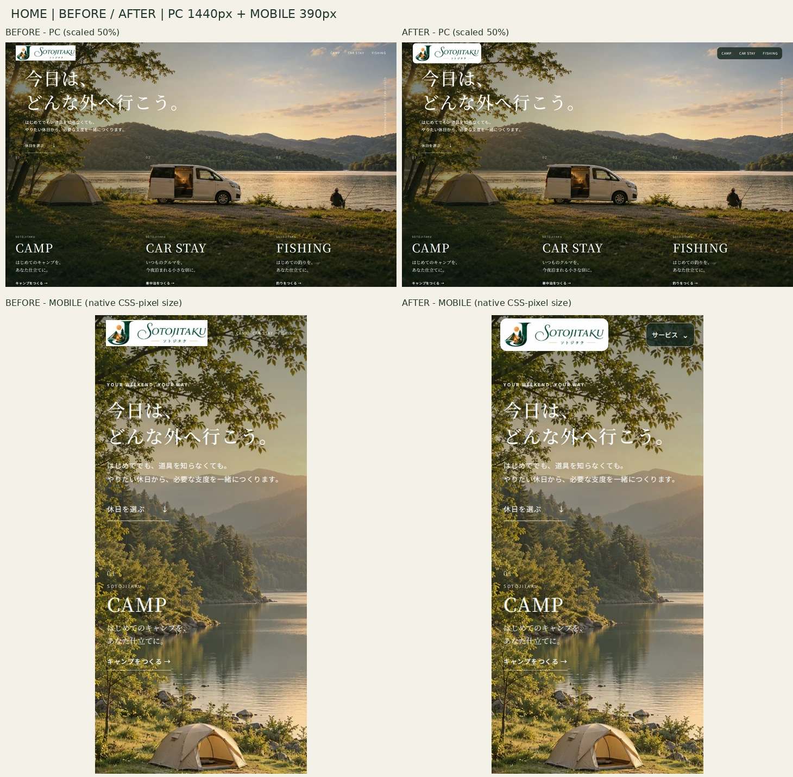
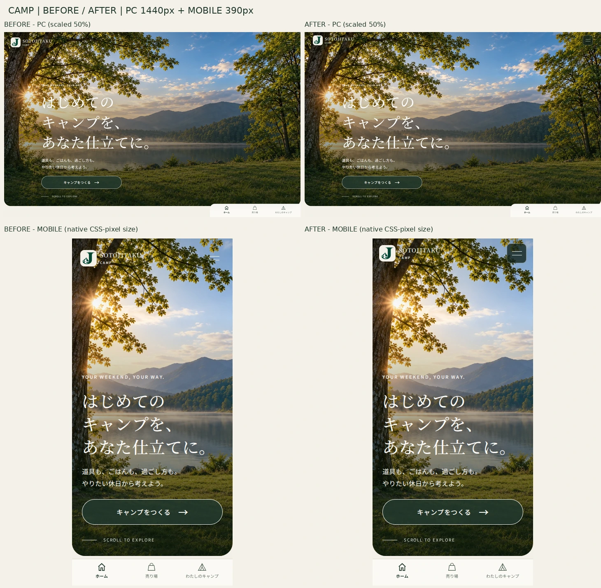
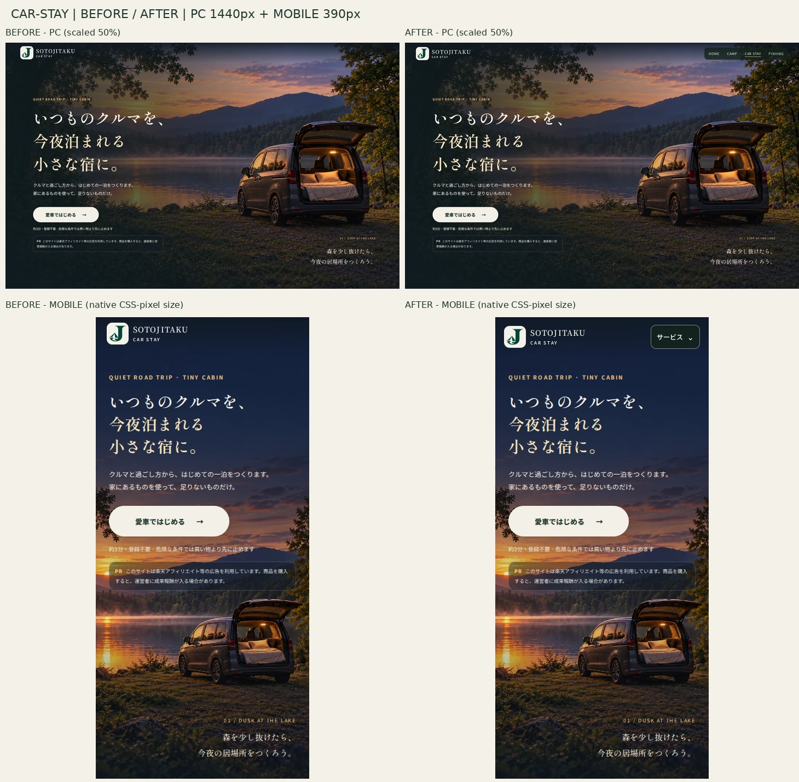
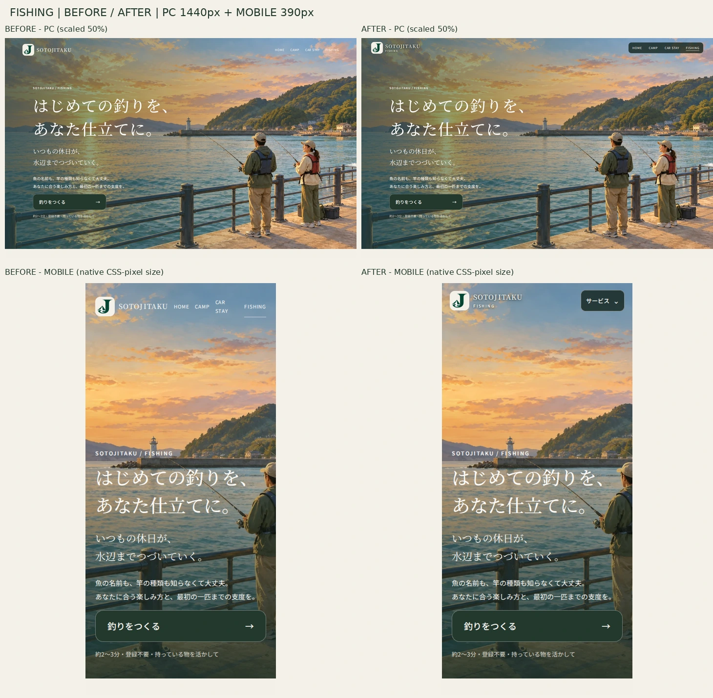

# SOTOJITAKU ブランド統合QA

監査日：2026-10-10。変更前：公開サイト／main `18221325f923bae1536ea76d23b0185d500c0a10`。変更後：専用ブランチのローカルプレビュー。**本番には未反映。承認後にPRをマージする工程が必要。**

## 結論と評価方法

改善前 **75/100** → 改善後 **88/100**。これは監査者によるデザイン・操作性評価であり、利用者調査やコンバージョン測定の結果ではない。100点とはしない。実機・実利用者の性能、GA4到達、全体のWCAG適合、SNSカードの実配信確認は未完了。

各項目：10＝実画面・機能・環境差まで根拠が揃い、重要な未確認事項なし／8–9＝高品質だが限定的な制約・未確認事項あり／6–7＝運用可能だが明確な不統一や操作性の問題あり。未測定値を採点の実測根拠として使わない。

| 項目 | 前 | 前の根拠・実際の問題 | 改善 | 後 | 後の検証根拠・残る制約 |
| --- | ---: | --- | --- | ---: | --- |
| ブランドの統一感 | 8 | ミニロゴは共有済み。高さ・戻り先・FISHING表記が不統一 | 共有ヘッダー寸法、HOMEへのリンク、サービス表記 | 9 | 24条件で80/72px、リンク先とロゴ原本を確認。固有の背景は保持 |
| ロゴの美しさと存在感 | 7 | HOMEの白い画像矩形が直接浮く。320pxはミニへ置換 | 原本を保持した白い角丸台座。320pxでも正式メイン | 9 | PC240px、スマホ174–196px。縦横比94/368、切り抜き・再生成なし。白台座は残す |
| HOMEの第一印象 | 8 | 風景とコピーは良好。小さなナビとロゴ周囲の扱いが弱い | 主要ロゴとサービスメニューの役割を整理 | 9 | PC・390/320px画面比較。コピー・3サービスの連続背景は不変 |
| サービスとの世界観の一貫性 | 9 | 3サービスの風景・メッセージは既に良好 | 背景や本文を変えず、入口の表記だけ統一 | 9 | 4ページの全画面・スクロール比較。CAR STAY固定、他ページの既存スクロール方式を保持 |
| PC表示の完成度 | 8 | ロゴとヘッダーの高さ、サービス切替がページごとに異なる | 80px・44px以上のリンク、暗い半透明背景 | 9 | 1440/1024px、横はみ出し・ロゴ/ナビ重なりなし |
| スマホ表示の完成度 | 6 | HOMEのナビ7px/約13px高。FISHINGのCAR STAYが375pxで折返し | 72pxヘッダー、44pxの開閉ボタンと48pxリンク | 9 | 768/390/375/320px、追加360px。正式ロゴとメニューの衝突なし。実端末Safariは未検証 |
| 文字・背景・ロゴの視認性 | 7 | 小さい白いサービス名、空背景上の操作部が弱い | ナビ・CAMPボタンの暗色背景と文字の補助影 | 8 | 操作部の色・寸法と実画面を確認。本文全体の画像上コントラストを全状態で数値保証していない |
| ナビゲーションの分かりやすさ | 7 | CAMPロゴはサービス内#home、CARは他サービスへのヘッダー導線なし | ロゴを全ページHOMEへ。CAR/FISH共通サービス切替 | 9 | HOMEのカード・ヘッダーから3サービスへ遷移とservice_select確認。CAMPの既存メニューは維持 |
| 診断開始までの使いやすさ | 9 | 元のCTAは既に大きく、約3分・登録不要の説明あり | CTAは変更せず、ヘッダーの混雑だけ解消 | 9 | 診断開始・選択・戻る・結果表示を実行。安全確認を商品提案より優先する挙動を維持 |
| 表示速度・アクセシビリティ・技術品質 | 6 | CAR/FISHのOGP画像・favicon参照なし、FISHの本文ジャンプなし | 既存画像・既存favicon参照追加、skip link、キーボード操作、回帰テスト | 8 | 24条件でJS/consoleエラー・画像失敗なし。低CLSのラボ計測。実利用者INPとGA4受信は未確認 |
| **合計** | **75** | | | **88** | |

## 発見した問題と優先順位

| 優先度 | 問題 | 対応・状態 |
| --- | --- | --- |
| P0 | 検証したシナリオで重大な機能障害・安全判定の回帰なし | 全ての未知の条件の安全性を保証する意味ではない |
| P1 | HOMEモバイルのサービスリンク7px・約13px高 | 44pxボタン／48pxリンクへ修正 |
| P1 | HOME320pxで主要ブランド表示がミニロゴになる | 同一の正式横型メインを174pxで表示 |
| P2 | HOMEの原画の白矩形、ヘッダー寸法の不統一 | 原画を加工せず角丸白台座、共有80/72px |
| P2 | CARに横断導線がなく、FISHナビが狭い画面で折返す | PCリンク／スマホのネイティブdetailsメニュー |
| P2 | CAMPロゴのHOMEへの戻り先、FISHサービス表記 | rootへの戻り先とFISHINGの副表記 |
| P2 | FISHINGにskip link、CAR/FISHにog:image・favicon参照なし | 既存の画像・faviconを参照、本文ジャンプを追加 |
| P2 | 本文全体のコントラスト、実端末・実利用者性能の確証不足 | 残課題。背景や既存本文の一括変更はしない |
| P3 | サービス固有のスクロール挙動・装飾差 | 固有の魅力と操作モデルを保持し、無理に統一しない |

## 実装・原本の保護

- HOME：`assets/brand/sotojitaku/main-horizontal-original-white.png`（368×94、不透明の白背景）を全幅で使用。PC240px、モバイルclamp(174px,48vw,196px)。周囲に6pxの白い台座を追加するCSSのみ。画像の白を透明化したり、曲線・風景・装飾文字を書き直したりしていない。
- CAMP/CAR STAY/FISHING：`assets/brand/sotojitaku/mini-64.png` をPC40px／モバイル32pxで使用。既存のテキストとサービス名を併記。16pxを使用・承認していない。
- 全ブランドPNG、背景画像、`assets/favicon.svg`の原本は変更なし。SVGは新たに正式ロゴとして採用していない。既存faviconの16px合格判定も行っていない。
- 診断エンジン・商品データ・楽天URL・GA4設定・背景・home.cssは変更なし。
- CARの固定ヘッダー、CAMPの既存メニューと下部ナビを維持。診断中は追加サービスメニューを隠し、元の「最初から」と競合させない。
- `alt=""`は、隣接テキスト／リンクのaria-labelで名称を提供し二重読み上げを避けるため。寸法属性とCSS比率は維持。
- GitHub Pages `/sotojitaku/` のサブパス下で検証。公開workflowはmain push限定。PR作成だけでは本番デプロイしない。

## PC・スマホの比較

上段は1440pxの画面を50%縮小して左右比較、下段は390pxの画面をCSSピクセル相当の幅で比較。左が公開版、右が未公開改善版。小サイズミニロゴの16px認識検証を代替する画像ではない。

## 表示検証

| ページ | 1440 | 1024 | 768 | 390 | 375 | 320 |
| --- | --- | --- | --- | --- | --- | --- |
| HOME | 合格 | 合格 | 合格 | 合格 | 合格 | 合格 |
| CAMP | 合格 | 合格 | 合格 | 合格 | 合格 | 合格 |
| CAR STAY | 合格 | 合格 | 合格 | 合格 | 合格 | 合格 |
| FISHING | 合格 | 合格 | 合格 | 合格 | 合格 | 合格 |

Chromium + Playwrightで実レンダリング。24条件のスクリーンショットとDOM寸法を取得。1440/390pxは全ページ・スクロール後も保存。24条件とも横はみ出し0、JS/consoleエラー0、同一サイト4xx0、未読込画像0。ヘッダーの追加360pxを含む28条件、キーボードの本文ジャンプ、メニューEnter/Escape/外側クリック、操作領域も確認。スマホ相当幅のデスクトップChromiumであり、実際のiPhone/Androidの検証とは異なる。

## 機能・収益化の回帰検証

| 対象 | 検証内容 | 状態 |
| --- | --- | --- |
| HOME | 6幅、カードとヘッダーの両方から3サービスへ実遷移、service_select | 合格 |
| CAMP | 7幅、7問の選択・戻る、手持ち品、食事・予算、結果、ダウンロード、再読込復元、商品リンク・affiliate_click | 合格 |
| CAR STAY | 6幅、診断・戻る・復元、電源計算、寸法再計算、危険7条件、商品URLとイベント、画像失敗・商品0件・計測opt-out | 合格6/6 |
| FISHING | 6幅×solo/family/pair/owned、戻る・結果、安全確認と子どもPFD、楽天別窓、保存、共有URL復元、やり直し | 合格24/24 |
| JavaScript unit | 診断・カタログ・計測・SEO・原本ハッシュ等143件 | 合格143/143 |
| Python unit | カタログ監査・取得処理・安全なリンク等149件 | 合格149/149 |
| 計測 | GA4の既存ID・イベント名、クリックイベントのdataLayer引数 | 静的/キュー検証。GA4サーバー受信は未検証 |
| SEO | 全4ページのtitle/description/canonical保持、OGP画像参照、既存favicon | DOM・参照確認。検索順位・SNSカードのキャッシュ配信は未検証 |

楽天の外部遷移はFISHINGで別窓をテスト応答に接続し、CAMP/CARではリンクと発火引数を検証。購入・決済・成果報酬の発生は実施していない。検証クリックは実GA4へ送信しない。

CAR STAYの元実装には共有ボタンがない。自動保存・復元を検証したが、新たな共有機能は追加していない。CAMPはエクスポート・保存復元、FISHINGはクリップボード共有・URL復元を確認。

## 表示速度・レイアウトシフト

同じマシン・同じローカル配信・冷たい新規ブラウザコンテキスト、フォントを同じ既存指定ファミリーのローカルTTFで供給、計測を無通信化して、4ページ×2幅×前後×3回＝48回測定。下表は中央値。CPU/ネットワークのスロットリングなし。**公開環境の速度やCore Web Vitalsの実利用者合格を意味しない。**

| ページ・幅 | LCP前→後(ms) | CLS前→後 |
| --- | ---: | ---: |
| HOME 1440 | 812→512 | 0.000119→0.000211 |
| HOME 390 | 648→584 | 0.000187→0.000426 |
| CAMP 1440 | 620→616 | 0.00000685→0.00000685 |
| CAMP 390 | 492→624 | 0.0000462→0.0000462 |
| CAR STAY 1440 | 1216→644 | 0.003726→0.003679 |
| CAR STAY 390 | 484→504 | 0.008604→0.008772 |
| FISHING 1440 | 148→156 | 0.0000565→0.0000657 |
| FISHING 390 | 204→152 | 0.000140→0.000137 |

改善版全条件のCLSは0.009未満。小さな増減はある。CAMPモバイルのLCPは132ms増加しており「全て高速化」とは言わない。3回の非スロットル計測では速度改善の因果関係を確定できない。既存の大きな背景・フォントを維持し、今回の追加は小規模なCSSと591 bytesのJS。実利用者INP・CrUX・Search Console CWVは取得していない。

## 変更ファイル

- `index.html`, `camp/index.html`, `car-stay/index.html`, `fishing/index.html`
- `assets/brand/brand-header.css`, `assets/brand/brand-navigation.js`（新規）
- `tests/brand-header-browser.mjs`, `tests/home-browser.cjs`, `tests/car-stay-browser.mjs`, `tests/fishing-browser.mjs`, `tests/brand-integration.test.mjs`（新規）
- `.github/workflows/verify-brand-logos.yml`（PRのヘッダー・診断・横断導線チェックを拡張）、`package.json`（新規JSの構文チェック）
- `docs/brand-integration-qa/QA-REPORT.md`と4比較画像（納品証跡）

ローカルテストのフォント待機・再読込タイムアウトを切り分けた。CARのテストルーティングはcontinueからfallbackへ変更し、検証環境のフォント経路を通すようにした。検証用サーバーのリクエストログを未消費のパイプに出していたため、連続実行で出力待ちとなって応答が停止した。ログの出力先を修正し、幅ごとに独立したブラウザでも再実行した。アプリの診断コードを変更して解決したようには扱わない。ZIPの最終ログと途中失敗ログは別フォルダに分ける。

HOME/CAR/FISHのネイティブメニューは320pxでJavaScript無効でも開閉・リンク表示を確認した。これは診断機能をJavaScript不要にしたという意味ではない。

## 残課題と公開判断

- P2：実端末Safari/Android、支援技術による通し操作、本文全状態のコントラスト監査。現時点で全体のWCAG適合を主張しない。
- P2：実利用者のLCP/CLS/INP、GA4受信、SNSカードの実配信。取得できなかった計測を合格としない。
- 16pxfaviconの未合格、元画像のネイティブ解像度、純ベクターSVGの採否は今回未変更。メイン画像は240px以下の表示で原本368pxを超える拡大をしていない。
- NAKAJITAKUは保管データを変更せず、サイトを作成していない。
- ローカルの最終回帰ログは合格。PR CIも確認後、**ユーザー承認を条件に公開可能**。未承認のmain変更、マージ、Pages手動デプロイは実施しない。
