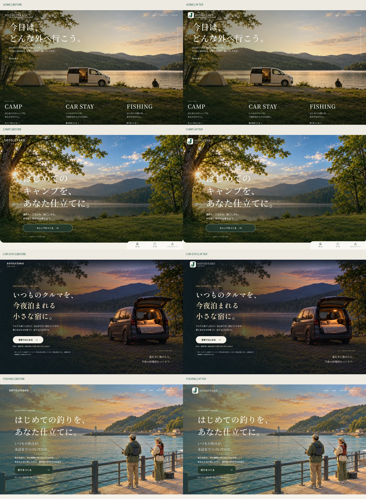
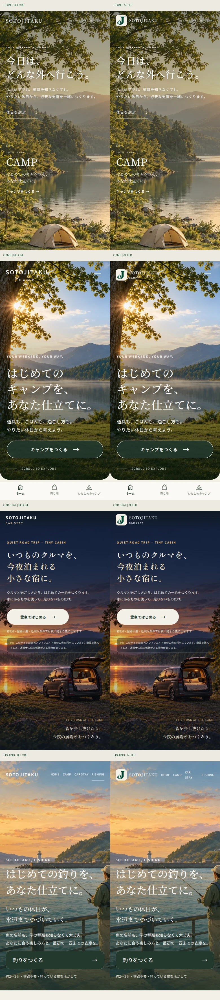

# SOTOJITAKU 正式ロゴ実装・公開前QA

2026-10-10 JST。公開判断：**レビュー可能。本番公開はユーザー承認待ち**。mainへの変更・マージ・Pages公開は行っていない。

## 実装

HOME・CAMP・CAR STAY・FISHINGのヘッダーに、確定済みの透過ミニロゴとブランド名を配置した。PCでは画像40×40px、800px以下では32×32px。アイコン部分だけにナチュラルベージュ #F5F1E8 の背景を付け、既存の風景・背景・本文・診断画面は維持した。320pxのFISHINGヘッダーは左右余白とリンク間隔を調整し、ナビゲーション文字の既存9pxサイズを維持する。

使用画像：`assets/brand/sotojitaku/mini-64.png`、`mini-128.png`（srcset 2x）。縦横比1:1、width/height指定、空altと既存リンク名で重複読み上げを防止。既存リンク先・aria-labelを維持。共通ヘッダー名には既存HOME/CAMP/FISHINGのNoto Serif JPを使用し、CAR STAYではヘッダー用に同じフォントを追加した。

画像の改変・再生成・トレース・色変更はしていない。SOTO/NAKA各9点、計18点を修正版ZIPのREADYからバイト一致で保管。SHA-256は`assets/brand/checksums.json`に記録。

| 正式PNG | SOTO寸法 | NAKA寸法 | 実装での用途 |
| --- | --- | --- | --- |
| main-horizontal-original-white.png | 368×94 | 403×94 | 原寸・白背景を保管のみ |
| main-vertical-original-white.png | 591×449 | 609×452 | 原寸・白背景を保管のみ |
| main-symbol-original-white.png | 322×318 | 317×319 | 原寸・白背景を保管のみ |
| mini-32/48/64/128/512.png | 各サイズの正方形 | 同左 | 64/128のみヘッダー採用 |
| mini-transparent-native.png | 514×463 | 501×466 | 元の透過画像を保管のみ |

メインの白い長方形を風景上に置くことは避けた。ミニには外側の透過と不透明の白い曲線が含まれる。NAKAはデータ保管のみで、ページやリンクは追加していない。確認用SVG・16px補正案は一切使用していない。16px未合格のため、ファビコンは既存設定を保持した。主ロゴの高解像度化・純ベクター化を今回の実装成果とはしていない。

## 表示確認

Playwright + Chromium **153.0.8010.0**、Linuxヘッドレス。`/sotojitaku/`のサブパスで静的配信し、変更前はmainの `9533e96bd233c3adec615f939698e85a747e8037`、変更後はレビュー用ブランチを使用。公開4ページのHTMLを取得し、アプリ・計測スクリプトが基準コミットと一致することも確認した。比較画像はこの基準コミットのローカル配信画面であり、本番更新後の画像ではない。

| ページ | 1440px | 768px | 390px | 320px |
| --- | --- | --- | --- | --- |
| HOME | 合格 | 合格 | 合格 | 合格 |
| CAMP | 合格 | 合格 | 合格 | 合格 |
| CAR STAY | 合格 | 合格 | 合格 | 合格 |
| FISHING | 合格 | 合格 | 合格 | 合格 |

全16表示でロゴ読み込み成功、ヘッダーとナビの重なりなし、横方向のはみ出しなし、コンソール/ページエラー0、ローカルHTTPエラー0、リクエスト失敗0、未読み込み画像0。背景との一体感と白い曲線はスクリーンショットで目視確認した。比較はPC1440px、スマホ390pxの4ページ分を並べ、原寸の変更前後32枚もZIPに含めた。

390px・DPR2の4ページでmini-128.pngを選択することを確認。ロゴ画像の取得を遅延させても読み込み前後の画像矩形は一致し、画像由来の位置・サイズ変化は0。サイト全体のCLS値が0であるという評価ではない。

## 動作回帰

| 検証 | 結果 |
| --- | --- |
| 構文チェック `npm run check` | 成功 |
| JavaScriptユニットテスト `npm test` | 140件成功、失敗0 |
| Pythonテスト | 149件成功 |
| 新規ヘッダー回帰テスト | 4ページ×4幅の16件成功 |
| HOME既存ブラウザテスト | 1440/1280/1024/390/375/360pxで成功、サービス導線を確認 |
| CAMP実ブラウザフロー | 1440/768/390/320pxで診断7問→計画完成→ダウンロード→再読込復元→売り場・楽天リンク確認、メニュー開閉も確認 |
| CAR STAY既存ブラウザテスト | 1440/760/430/390/320pxで診断・保存復元・危険条件・電力・実測値・商品推薦・計測イベント成功。画像失敗時フォールバック、SEOプリセット、商品0件、計測拒否も成功 |
| FISHING既存ブラウザテスト | 320/390/1440px×ひとり/家族/ふたり/所持品あり、12フロー成功。戻る・保存復元・子ども用適合確認・楽天リンク・イベント・共有リンク・クリップボード・再診断を確認 |
| SEO/OGP/ファビコン | title・canonical・OGP・faviconが変更前後16表示で一致。全meta・全script（GA4/JSON-LDを含む）も変更前後で一致 |

既存CAR STAYとFISHINGテストの最初の実行では再読み込み直後の待機タイムアウトが発生した。アプリコードは変更せず、ローカル実行補助側でstartボタン有効化（アプリデータ準備完了）を待ってから次の操作へ進むようにして再実行し、全項目が通過した。新規テストの初回には既定の選択肢を解除する操作とCAMPメニューの誤ったセレクタがあり、テスト手順を修正して16件を再実行した。失敗をアプリ修正として隠していない。

検証時はGA送信を遮断し、既存dataLayerイベントと計測コード保持を確認した。楽天遷移はテスト応答で確認し、商品購入はしていない。Google Fontsは同じ公式フォントファイルをローカル供給し、フォント読み込みを安定させた。

## 限界・未確認

- Chromiumの画面幅・DPR検証であり、実機スマホ・Safari/WebKit・Firefoxの確認は未実施。
- GA4サーバーでの実受信・本番Search Console・SNS側OGPキャッシュ・楽天の実売在庫は今回の確認対象外。
- 新規PR用GitHub Actionsの結果はローカル検証とは区別し、PRのChecksで確認する。
- 16px正式ミニの識別性は未合格のまま。本番ファビコンを今回のミニへ変更する承認は出ていない。

## 変更ファイル・公開手順

4つのindex.html、共通CSS、SOTO/NAKAのPNG18点と出典/チェックサム、新規ブラウザテスト、非公開用PR検証ワークフロー、比較画像2点、このQA文書。正確な30ファイル一覧はZIPの`changed-files.json`を参照。

既存Pagesワークフローはmainへのpushで公開するため、レビュー専用ブランチに保存する。追加検証ワークフローはpull_request限定・contents:readで、Pages書込権限やデプロイ処理を持たない。**ユーザー承認後にのみmainへマージする**。承認後は既存Pagesワークフローで公開し、公開4URLのロゴ読み込み・診断導線を再確認する。

